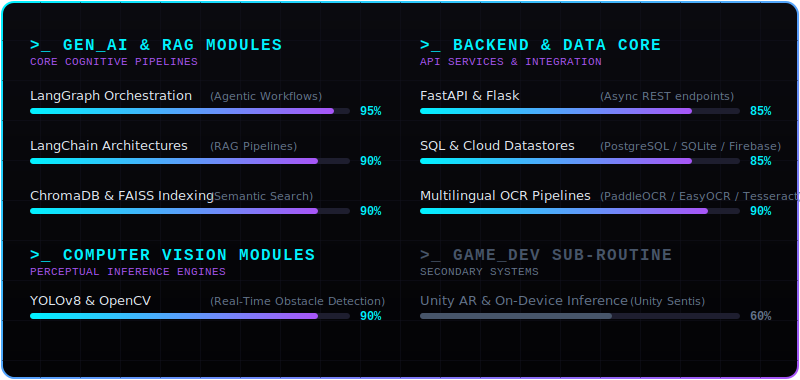

# 👋 Hi, I'm M Muddu Krishna

  

  🧠 <strong>AI & ML Architect</strong> specializing in building production-grade RAG pipelines, agentic workflows, computer vision systems, and intelligent automation engines.

---

## ⚡ System Overview / Character Bio

| Feature | Specification |
| :--- | :--- |
| **Current Target** | Engineering resilient, local-first RAG architectures and intelligent multi-tool agents. |
| **Field Deployments** | Internships at **Talent Smart Soft Solutions** (GenAI/ML Workflows) and **ReNote AI** (OCR/RAG Pipelines). |
| **Academic Uplink** | **B.Tech in AI & ML (With Honors)** — GMR Institute of Technology |
| **Operational Core** | Python, LangChain, LangGraph, OpenCV, YOLO, FastAPI, SQLite, PostgreSQL. |

---

## 💻 System Diagnostics / Core Skillset Inventory

  

---

## 🛠️ Neural Specifications / Technical Stack

  <!-- Languages -->
  
  
  
  
   
  <!-- ML / DL -->
  
  
  
   
  <!-- Data & GenAI -->
  
  
  
  
   
  <!-- CV & Tools -->
  
  
  

---

## 🚀 Deployed Missions / Featured AI Projects

### 🛡️ [Sentio — Mindful Social Sandbox with AI Moderation](https://github.com/mmkyadav/Sentio_App)
* **Objective:** Explored production-grade content safety using LLMs integrated into modern web frameworks.
* **Architecture:** Fast asynchronous FastAPI backend querying `gemini-2.5-flash` for real-time structured classification, OCR visual parsing, and PDF/Word extraction. Contains a custom multi-database adapter layer supporting PostgreSQL (Supabase), libSQL (Turso), and SQLite with automatic fallback.
* **Tech:** React 19, TypeScript, Zustand, FastAPI, Google GenAI SDK, SQLite/Postgres.

### 🧠 [Cyber Intelligence Agentic System](https://github.com/mmkyadav/cyber-intelligence-system)
* **Objective:** Built an agentic backend to transform the static *Cyber Ireland 2022 PDF Report* into a dynamic queryable intelligence system.
* **Architecture:** Built specialized tools for semantic text retrieval (ChromaDB), structured table analytics (SQLite), and CAGR mathematical projections. An agent router classifies intents and maps queries to the correct tool.
* **Tech:** FastAPI, ChromaDB, SQLite, sentence-transformers, Python.

### 🔮 [Visionary AI: Image Describer & Evaluation Framework](https://github.com/mmkyadav/Image_Descriptor)
* **Objective:** Explored LLM-as-a-Judge and ground-truth benchmarking metrics for multimodal visual applications.
* **Architecture:** Utilizes `gemini-2.5-flash` for high-quality single/batch image summarization, and queries **Meta Llama 3** (via OpenRouter) to evaluate descriptions against human ground truths, outputting structured JSON metrics.
* **Tech:** FastAPI, Streamlit, OpenRouter, Google GenAI SDK, Pandas, openpyxl.

### ⚖️ [Indian Legal RAG Chatbot](https://github.com/mmkyadav/indian-legal-rag-chatbot)
* **Objective:** Build an educational legal Q&A assistant to query unstructured legal acts and policies.
* **Architecture:** Ingests legal documents, chunks and embeds texts, and uses ChromaDB + Hugging Face Transformers (`google/flan-t5-base`) to answer legal questions with strict context boundaries.
* **Tech:** Python, LangChain, ChromaDB, PyPDFLoader, Google Colab.

### 📱 [AI Obstacle Detection & AR Navigation Assistant](https://github.com/mmkyadav/AI-Navigation-System)
* **Objective:** Assist visually impaired users with real-time surroundings scanning and audio directions.
* **Architecture:** Built a YOLOv8-powered computer vision model hooked to a FastAPI server providing 15-20 FPS inference to a React Native (Expo) mobile frontend.
* **Related Work:** *[Blind-Navigation_using_AR](https://github.com/mmkyadav/Blind-Navigation_using_AR)*—A Unity AR prototype utilizing YOLOv5 and **Unity Sentis** for on-device inference, earning a published paper.

---

## 🌐 Uplink Protocol / Connect with Me

  
  &nbsp;
  
  &nbsp;
  
  &nbsp;
  
  &nbsp;
  

